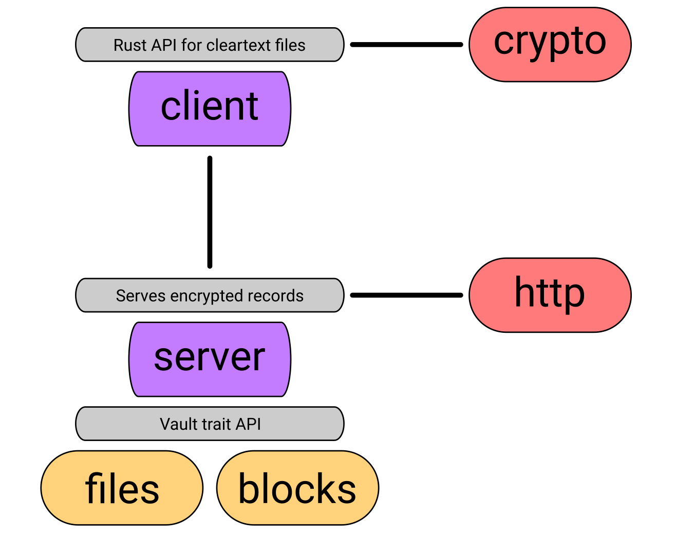
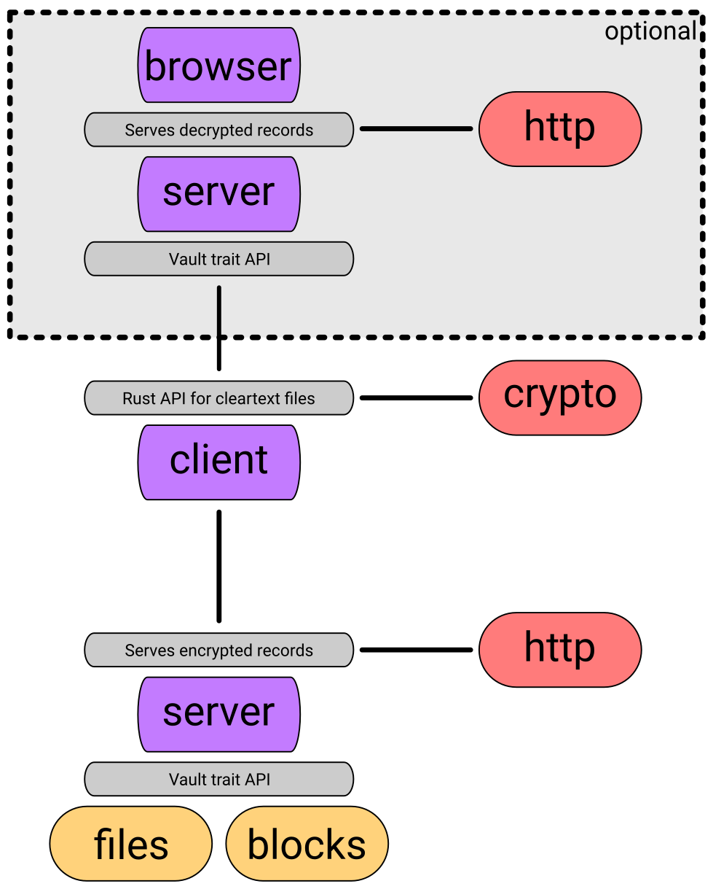

# lockchain

A modern, cross-platform and extendable secrets manager toolchain.

`lockchain` is a series of interconnecting libraries, 
that provide common functionality
for secrets, key and password managers.
They are written in Rust, 
a fast and low-level, 
memory-safe systems language
created by Mozilla.

At it's centre, 
`lockchain-core` provides common interfaces, utilities and modules
that can be used by both central `lockchain` libraries
as well as external user code
to build robust systems
and extend on existing ones.

**There are some graphical representations below**

---

**A full application stack**

## Security notice

The cryptography in this crate has not undergone any formal review or verification. While stability and data integrity can be thoroughly tested, the security of this crate can not be guaranteed. **Use it at your own risk!**
